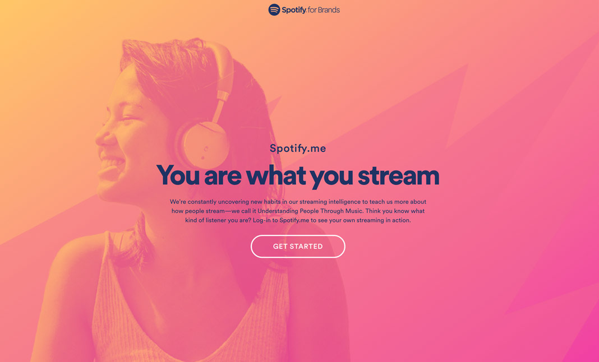

## An Introduction to Race and Gender in Spotify Searches

> Conducted by: Maxine Addo-Kufuor, Adam Bi, Danielle Blevens, Sarah Champ, Anqizi Xu, Benjamin Shi

### Introduction:
Spotify is a globally recognized digital music streaming service. Their music library
contains a wide range of music genres that serves to a diverse audience. However, as is the case
with many services, there are limitations that affects how certain users interact with a product.
For instance, white heterosexual men have long been centered and depicted as the “average” user
for many internet services, resulting in the exclusion of people of color, women and queer
identified users. Often times, these underrepresented groups have come across challenges that the
perceived average user would not have been met with. In this study, we explore how gender and
race bias are inserted in Spotify’s search results. Understanding gender and race in relation to
technology allows one to grasp a deeper understanding of data classification and accessibility.
Centering gender and race in technology can reveal a lot about the root causes of biased data.

To begin with, focusing on Spotify’s intersection with gender gives us interesting insights
into how its developers understand themes such as gender and sexuality. For one, although this is
more often and more obvious in the case of dating apps, many social media platforms
demonstrate that they do not design with queer users in mind. On apps such as Tinder, queer
users have dealt with the challenges of being matched with heterosexual users or encountering
fake profiles. In Queer women’s experiences of patchwork platform governance on Tinder,
Instagram, and Vine, a study was conducted to examine queer women’s relationship to social
media platforms. The study dives into the shortcomings of platforms such as the aforementioned,
finding that the biases that feed these platforms shape the experiences of those who use them.
They addressed, for instance, the failure of governance on Tinder due to queer women being
matched with men hiding behind female profiles (Burgess, Duguay & Suzay, 2018). Another
example of algorithmic biases, more specific to our own topic, is seen with Spotify’s default
country music playlist. In September of 2019, country artist Martina McBride spoke out against
Spotify for their lack of female representation in their country music playlist (Dredge, 2019).
McBride expressed disappointment when discovering the over representation of male country
artists on the application. The erasure of female artists in the country music playlists, speaks to
the larger issue of country music’s association with masculinity. Despite women’s contribution
to country music, it is known that the genre is male dominated. Spotify’s algorithm mirrors this
gender imbalance, by hindering female artists from being being streamed. In turn, as we conduct
our study, we will explore the gender-based limitations a specific user will come across as they
use Spotify and how it reflects on social norms.

Likewise, a close examination at apps within the social media space also helps us to
understand how racially charged biases manifest within the services used by millions across
diverse demographics every day. In much the same vein as many services’ tendencies to imagine
their default users as heterosexual men, the intended users of an app are oftentimes subtly
shown--whether through images or through implicit language--to be primarily white. Although
many apps and services today mention a commitment to “diversity”, the methodology through
which they demonstrate such a commitment oftentimes ignore the cultural differences that are
inherently tied to race, suggesting that white people are the default audience while others are
either an afterthought or a ‘special’ class. For instance, even before going too much in detail on
our study of Spotify, the meer existence of preset playlists such as “Black History Month” and
“Korean Pop” suggest that these are playlists catered to special interest groups, while the lack of
any corresponding playlist with “White” in its name suggests that white people are in fact
already accounted for as the default for everything else. Throughout our study on the racial
elements displayed within a user’s experience with the Spotify app, thus, we will detail the subtle
implications made by Spotify’s structure on the topic of racial biases.

Moving on to the app itself, one immediately then encounters the first step in Spotify’s
algorithms for data collection and categorization. Upon first launching the app or online site,
users find themselves required by Spotify to fill in their personal information before proceeding
onto their application. The three options for “gender” are male, female, and non-binary. There is
no field for race at all. Our research will thus explore a combination of how Spotify’s search
feature yields distinct results based on gender identity, and also on how race modifies this
experience in a space where users do not input their race to begin with. The study will take an indepth look at how user interaction is based on a user’s recorded information. The design plan requires our team to create accounts made under different gender identities, leaving race
ambiguous since there is no way to modify it. The users will then enter specific search topics
and analyze the results displayed in their search results. We will evaluate how Spotify’s
algorithms cater to a specific audience, and the limitations that non-male, non-heterosexual, and
non-white users will come across when using the service.

Putting all these themes together, we hope to continue a line of research undertaken by
numerous leading scholars who work on revealing the hidden biases behind the seemingly
‘neutral’ apps behind our everyday experiences. In Algorithms’ of Oppression, for example,
Safiya Noble discusses how discrimination is entwined in software. The book highlights how
marginalized people have been misrepresented in Google’s search results (Noble, 2018, pg.4).
Noble addresses the pervasiveness of racism and sexism, and her work guides us to better
understand how search results narrow and distort information. Sexism, gender bias, and racism in
technology are widely discussed topics, and many researchers like Noble have found that
designers and engineers take on extremely biased approaches when developing applications
within the tech space. Given that technology is a white-male dominated field, it is not surprising
that even up-and-coming technologies such as artificial intelligence perpetuate gender and race
biases in a time when society tries so hard to label itself as inclusive and progressive. Through
our examination of the user experiences offered by Spotify’s app, we hope to bring to light how
some of these biases hide themselves behind the curtain of an assumption of neutrality. More
specifically, through our exploration of Spotify’s platform, we want to see how our gender
identity affects the search results we are given, as well as how our demonstrated interest in racespecific genres affects the racial elements of the music recommendations Spotify then gives us.

Picture taken from Spotify’s own home page, at spotify.me/en. Are we what we stream, or do
we stream what we are (according to Spotify)?

> Check out the material to learn more about [our reserach proposal](doc2.md)  
> Check out the [Spotify terms and conditions](https://www.spotify.com/us/legal/end-user-agreement/)
